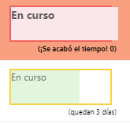

# Creación de barras Rojo-Ambar-Verde (RAV) basadas en rangos de fechas

## date-range-rag.json
Este ejemplo crea barras de datos coloreadas en el campo actual basadas en los campos `DueDate` y `StartDate` comparados con la fecha/hora actual. La barra se llena hacia el 100% a medida que "Hoy" se acerca a la fecha de vencimiento. Se determina un ancho porcentual basado en el número total de días entre el StartDate del elemento y el DueDate del elemento.

A diferencia de otros ejemplos, este aplica el formato a un campo mirando el valor dentro de otros campos. Tenga en cuenta que `DueDate` y `StartDate` son referenciados usando la sintaxis `[$FieldName]` donde FieldName es el nombre interno del campo. Este ejemplo también aprovecha un valor especial que puede utilizarse en los campos de fecha/hora: `@now`, que resuelve la fecha/hora actual, evaluada cuando el usuario carga la vista de lista.

>Nótese que la columna "Hoy" mostrada arriba no se utiliza en el formato. Se proporciona como referencia para que pueda ver cómo se aplicó el formato con las fechas dadas.

Los colores utilizados están determinados por las clases aplicadas:

|Condición|Clase
|---|---|
|Fecha de vencimiento <= Ahora|Sp-field-severity--severeWarning
|Número de días transcurridos entre StartDate y DueDate > 70% del total de días.
|Si la fecha de vencimiento es superior al 70% del total de días.

Si la `Fecha de vencimiento` aún no ha pasado, el ancho de la barra se determina calculando el porcentaje de días que han pasado desde la `Fecha de inicio` y la `Fecha de vencimiento`.

Además, el valor del campo (`@currentField`) se muestra cuando hay un valor.

## date-range-rag-days-left.json

En esta versión de la muestra, los días restantes se muestran dentro de la caja:

## 

## fecha-dias-restantes.json

Versión traducida y adaptada a partir de la anterior con algunos cambios del diseño, los días restantes se muestran dentro de la caja:

## 

Esta versión de la muestra demuestra que se pueden sortear las limitaciones del formato de la lista en lo que respecta al redondeo de los números. Se proporcionan múltiples condiciones para asegurar que los números calculados se muestren sin precisión innecesaria.

## Requisitos de visualización
- Este formato se puede aplicar a cualquier tipo de columna
- Se espera una columna adicional DateTime con un nombre interno de `DueDate`.
- Se espera una columna adicional DateTime con un nombre interno de `StartDate`.

## Ejemplo

Solución|Autor(es)
--------|---------
date-range-rag.json | [Christopher Parker](https://twitter.com/ChrispyBites)
date-range-rag-days-left.json | [Joe Ayre](https://github.com/JoeAyre)

## Historial de versiones

Versión|Fecha|Comentarios
-------|----|--------
1.0|13 de junio de 2018|Lanzamiento inicial
1.1|25 de julio de 2018|Actualizado para incluir la clase ámbar
1.2|20 de agosto de 2018|Actualizado para utilizar expresiones de estilo Excel, añadir una clase de fuente temática y simplificar los cálculos
1.3|12 de agosto de 2019|Agregado el ejemplo de los días de la izquierda

Versión|Fecha|Comentarios
-------|----|--------
2.0|24 de abril|Fork [repositorio original](https://github.com/pnp/List-Formatting)
2.1|25 de abril|Traducción Readme.md y archivo ejemplo formato de fecha [date-range-rag-days-left.json](https://github.com/CollaborativeWork/List-Formatting/blob/master/column-samples/date-range-rag/date-range-rag-days-left.json) a [días restantes](https://github.com/CollaborativeWork/List-Formatting/blob/master/column-samples/date-range-rag/fecha-dias-restantes.json) por [Ernesto Barrera](https://github.com/ErnestoBarrera)

## Aviso legal
**ESTE CÓDIGO SE PROPORCIONA *COMO ESTÁ* SIN GARANTÍA DE NINGÚN TIPO, YA SEA EXPRESA O IMPLÍCITA, INCLUYENDO CUALQUIER GARANTÍA IMPLÍCITA DE IDONEIDAD PARA UN PROPÓSITO PARTICULAR, COMERCIABILIDAD O NO INFRACCIÓN.**

---

## Notas adicionales

- [Utilice el formato de columna para personalizar SharePoint](https://docs.microsoft.com/en-us/sharepoint/dev/declarative-customization/column-formatting)

> También se proporciona una versión adicional que utiliza la Sintaxis de Árbol Abstracto (AST) para entornos en los que no se admiten las expresiones de estilo Excel.

