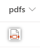

# Convierte el campo FileRef en una imagen en miniatura o en un hipervínculo sobre el que se puede hacer clic

## Resumen
Este ejemplo utiliza una columna para generar un hipervínculo al Item Thumbnail de una biblioteca de documentos.
* Utiliza la variable FileRef
* Utiliza getpreview.ashx

### Antes de usar generic-hyperlink-thumbnail
* Ajuste el valor de resolución=**3** (0-6) a sus NECESIDADES. (3: 1024px, 4: 1600px)_

### generic-image-thumbnail 
fundamentos de: https://github.com/SharePoint/sp-dev-list-formatting/tree/master/column-samples/picture-roundimage-format

* Ajuste los tamaños de las miniaturas o los bordes redondeados según sus necesidades. 

## Requisitos de visualización
- Este formato se puede aplicar a cualquier tipo de columna (el valor se ignora)
- Este formato debe ser utilizado en una Biblioteca de Documentos

## Muestra

Solución|Autor(es)
--------|---------
generic-hyperlink-thumbnail.json | Josef Lahmer
generic-image-thumbnail.json | Josef Lahmer

## Historial de versiones

Versión|Fecha|Comentarios
-------|----|--------
1.0|17 de julio de 2018 |Lanzamiento inicial
1.1|20 de agosto de 2018|Cambiado a expresiones de estilo Excel
1.2|9 de enero de 2019|Se ha eliminado la url codificada y se ha sustituido por el token @currentWeb
1.3|9 de abril de 2019|Corrección de errores en @currentWeb, + generic-image-thumbnail
2.0|26 de abril de 2021|[Nuevo archivo json](https://github.com/CollaborativeWork/List-Formatting/blob/master-es/column-samples/generic-hyperlink-thumbnail/sustitucion-link-por-icono-pdf.json) con formato para sustituir url a archivo pdf por icono

## Aviso legal
**ESTE CÓDIGO SE PROPORCIONA "TAL CUAL" SIN GARANTÍA DE NINGÚN TIPO, YA SEA EXPRESA O IMPLÍCITA, INCLUYENDO CUALQUIER GARANTÍA IMPLÍCITA DE IDONEIDAD PARA UN PROPÓSITO PARTICULAR, COMERCIABILIDAD O NO INFRACCIÓN.

---

## Notas adicionales
- [Utilice el formato de columna para personalizar SharePoint](https://docs.microsoft.com/en-us/sharepoint/dev/declarative-customization/column-formatting)

> También se proporciona una versión adicional que utiliza la Sintaxis de Árbol Abstracto (AST) para entornos en los que no se admiten las expresiones de estilo Excel.

